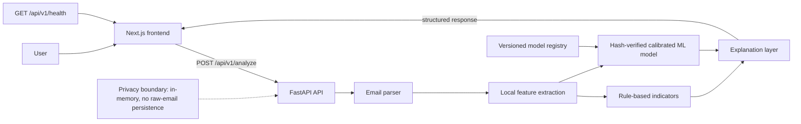

# PhishShield AI

PhishShield AI is an explainable phishing-risk analysis workspace for suspicious email. It combines local email parsing, deterministic security indicators, and a calibrated ML candidate model behind a typed FastAPI API and responsive Next.js interface.

> Release-candidate status: local integration is validated. The deployment-candidate model is inactive and the application has not been deployed.

## What it does

- Accepts raw RFC822 email source from the browser.
- Parses headers, body text, links, and attachment metadata locally.
- Runs rule-based indicators and the hash-verified calibrated ML candidate.
- Returns risk score, probability, confidence, signal families, and recommendations.
- Keeps the current analysis in memory; it does not store raw email content.
- Does not render email HTML, follow URLs, or execute attachments.

This is decision support, not a guarantee of safety or a replacement for mail security controls and human review.

## Product preview

Capture these deterministic views using the safe example in the Analyze workspace:

- `docs/images/landing-page.png` — landing page at 1440 px.
- `docs/images/analysis-input.png` — `/analyze` before submission at 1440 px.
- `docs/images/phishing-result.png` — `/analyze` after the safe synthetic example is submitted.
- `docs/images/mobile-analysis.png` — `/analyze` at 390 px.

No screenshots are committed yet. See [docs/SCREENSHOTS.md](docs/SCREENSHOTS.md) for capture instructions.

## Architecture



Detailed diagram: [docs/ARCHITECTURE.md](docs/ARCHITECTURE.md).

## Technology

- Frontend: Next.js 15 App Router, React 19, TypeScript, Tailwind CSS, Lucide icons.
- Backend: FastAPI, Pydantic, local RFC822 parsing, rule analysis.
- ML: scikit-learn, TF-IDF, calibrated Logistic Regression candidate, versioned registry.
- Validation: pytest, Node test runner, ESLint, TypeScript, Next.js production build.

## Local setup

Requirements: Python 3.11+, Node.js, and npm.

```powershell
# backend
apps\api\.venv\Scripts\python.exe -m uvicorn app.main:app --reload --app-dir apps/api

# frontend
cd apps/web
npm install
Copy-Item .env.example .env.local
npm run dev
```

Open `http://localhost:3000`. The API is expected at `http://localhost:8000`.

Frontend configuration:

```text
NEXT_PUBLIC_API_BASE_URL=http://localhost:8000
```

See [apps/web/README.md](apps/web/README.md) for troubleshooting and the complete local workflow.

## API

| Method | Route | Purpose |
| --- | --- | --- |
| `GET` | `/api/v1/health` | API, model, calibration, candidate, and activation status |
| `POST` | `/api/v1/analyze` | Parse and analyze `{ "raw_email": "..." }` |

The analysis response includes `model_id`, `model_version`, `prediction`, `probability`, `risk_score`, `confidence`, `threshold_used`, `feature_families`, `signals`, `recommendations`, and `processing_time_ms`.

## Model and evidence boundaries

The selected candidate is `phase-c-logistic-regression-v1`, calibrated with isotonic regression at threshold `0.5`. It remains `deployment_candidate=true` and `activated=false`. Phase C found useful external performance but material template-shift and hard-negative limitations; no production accuracy claim is made.

The model registry and training/evaluation evidence are documented under `services/ml/`. Model binaries and generated reports remain Git-ignored.

## Privacy and security

The frontend does not persist submitted email, render HTML, create clickable extracted URLs, send analytics, or expose model internals. The backend processes content in memory and avoids URL fetching and attachment execution. Please do not test with real sensitive mail in public issue reports. See [SECURITY.md](SECURITY.md) and [docs/DEPLOYMENT.md](docs/DEPLOYMENT.md).

## Project layout

```text
apps/api/       FastAPI application, parser, rules, and inference endpoint
apps/web/       Next.js interface and typed API client
services/ml/    Dataset controls, model development, registry, and reports
docs/           Architecture, release, demo, screenshot, and deployment guides
```

## Checks

```powershell
cd apps/web
npm run lint
npx tsc --noEmit
npm test
npm run build

cd ../..
apps\api\.venv\Scripts\python.exe -m pytest apps/api/tests services/ml/tests -q
git diff --check
```

See [CHANGELOG.md](CHANGELOG.md) for the unreleased release-candidate work and [docs/RELEASE_CHECKLIST.md](docs/RELEASE_CHECKLIST.md) for sign-off items.
