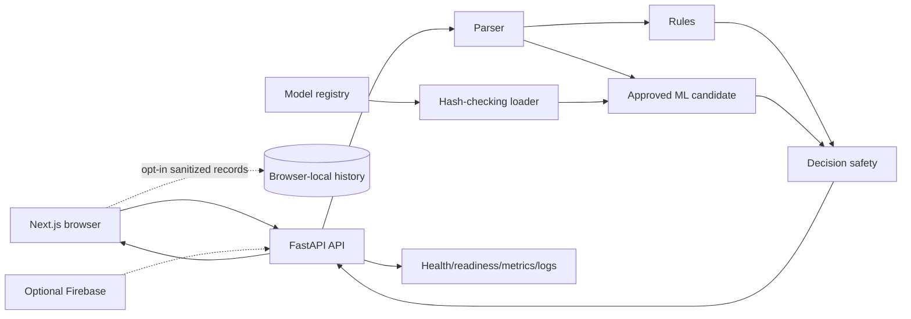

<p align="center">
  
</p>

<h1 align="center">PhishShield AI</h1>

<p align="center"><strong>Explainable phishing detection with evidence-aware decision safety.</strong></p>

<p align="center">
  <a href="https://www.python.org/"></a>
  <a href="https://fastapi.tiangolo.com/"></a>
  <a href="https://nextjs.org/"></a>
  <a href="https://www.typescriptlang.org/"></a>
  
  
  
  
</p>

<p align="center">A defensive cybersecurity workspace for analyzing suspicious email and helping a human reviewer understand what needs verification.</p>

> Portfolio presentation: the screenshot and video files are intentionally manual deliverables. See [`docs/SCREENSHOT_PLAN.md`](docs/SCREENSHOT_PLAN.md) and [`docs/DEMO_RECORDING_PLAN.md`](docs/DEMO_RECORDING_PLAN.md).

## Why it exists

PhishShield AI combines a Next.js interface, a FastAPI service, local RFC822/MIME parsing, deterministic security indicators, and a hash-checked local machine-learning candidate. It is intended to support human review during triage; it does not guarantee safety, identify every phishing message, or replace mail security controls.

## Key capabilities

| Evidence-first analysis | Decision safety | Privacy-conscious workflow |
| --- | --- | --- |
| Parses headers, body text, HTML text, URLs, and attachment metadata locally. | Keeps raw ML probability visible while allowing corroborated deterministic evidence to prevent an unjustified safe presentation. | Processes input in memory, avoids URL fetching and attachment execution, and keeps optional history in the browser. |

| Multiple input modes | Supply-chain checks | Honest operations |
| --- | --- | --- |
| Quick Paste, raw RFC822, and `.eml` upload. | Registry-controlled model selection with artifact, vectorizer, and manifest hash validation. | Health, readiness, metrics, request IDs, bounded inputs, rate limits, safe errors, and privacy-safe logs. |

## Problem statement

Email risk evidence is distributed across wording, headers, authentication results, links, HTML, and attachment metadata. PhishShield AI makes those signals easier to inspect without rendering email HTML, following URLs, executing attachments, or requiring the user to send raw email to a third-party analysis API.

## Core capabilities

- Quick Paste, raw RFC822 source, and `.eml` input modes.
- Local parsing of headers, plain text, visible HTML text, URL evidence, and attachment metadata.
- Rule-based indicators with signal severity, evidence, and recommendations.
- Optional calibrated text-model inference through a versioned registry.
- Explicit model/rule agreement, limited-evidence warnings, and safe fallback behavior.
- Optional browser-local scan history and browser-generated reports. History is disabled unless the user enables it; raw bodies and complete raw headers are excluded from saved records.
- Request IDs, bounded payloads, process-local rate limits, safe errors, security headers, CSP, privacy-safe logs, health, readiness, and metrics endpoints.

## Portfolio preview

The following files are planned captures, not broken image links. Add each image only after a human has captured and privacy-reviewed it.

| Planned asset | Status |
| --- | --- |
| `landing-light.png` | Capture pending |
| `dashboard-light.png` | Capture pending |
| `analyzer-input.png` | Capture pending |
| `phishing-result.png` | Capture pending |
| `decision-safety.png` | Capture pending |
| `indicators.png` | Capture pending |
| `history.png` | Capture pending |
| `reports.png` | Capture pending |
| `settings.png` | Capture pending |
| `architecture.svg` | Mermaid source ready; reviewed export pending |

See the complete matrix in [docs/SCREENSHOT_PLAN.md](docs/SCREENSHOT_PLAN.md) and the asset library in [docs/assets/](docs/assets/).

## Architecture overview

The browser submits synthetic or user-provided email to the FastAPI boundary. The service parses it in memory, runs rule analysis, optionally loads the registry-selected candidate after hash validation, fuses the available evidence, and returns a typed response. The frontend may store sanitized scan records in browser storage only when the user enables that preference.


```mermaid
flowchart LR
  browser[Next.js browser] --> api[FastAPI API]
  api --> parser[Parser]
  parser --> rules[Rules]
  parser --> ml[Approved ML candidate]
  rules --> safety[Decision safety]
  ml --> safety
  safety --> api
  api --> browser
  browser -. opt-in sanitized records .-> local[(Browser-local history)]
  registry[Model registry] --> loader[Hash-checking loader] --> ml
  api --> obs[Health/readiness/metrics/logs]
  firebase[Optional Firebase] -.-> api
```

See [docs/ARCHITECTURE.md](docs/ARCHITECTURE.md) and [docs/API.md](docs/API.md).

## Demo flow

1. Start at `/` and introduce the privacy boundary.
2. Use `/analyze` to compare Quick Paste, raw source, and `.eml` input.
3. Scan the safe synthetic note, then the synthetic impersonation fixture.
4. Show the indicator families, rule/ML disagreement, and decision-safety panel.
5. Review browser-local history and reports.
6. Close with health/readiness, model limitations, and the architecture.

The exact 3-5 minute script is in [docs/DEMO.md](docs/DEMO.md). The synthetic inputs are in [docs/assets/demo/](docs/assets/demo/).

## Technology stack

- Frontend: Next.js 15 App Router, React 19, TypeScript, Tailwind CSS, Lucide icons.
- Backend: Python 3.11+, FastAPI, Pydantic, Uvicorn, Python email/MIME parsing.
- Analysis: deterministic Python analyzers, offline domain comparison, scikit-learn, Joblib, NumPy, SciPy.
- Optional integration: Firebase Admin SDK is present but not an authorization layer.
- Validation: pytest, Node's built-in test runner, TypeScript, ESLint, Next.js build, pip check, npm audit, and static security/deployment tests.

## Security and privacy highlights

- Email is parsed as data in memory; submitted HTML is not rendered, URLs are not fetched, and attachments are not executed or content-scanned.
- Optional browser-local history stores sanitized summaries only; raw bodies and complete raw headers are excluded.
- The API applies request-size limits, MIME/parser bounds, exact CORS, request IDs, process-local rate limits, safe errors, security headers, `no-store` responses, readiness, and privacy-safe structured logs.
- Model artifacts are a supply-chain trust boundary: registry metadata, compatibility, manifests, and SHA-256 hashes are checked before deserialization.
- Firebase is optional and is not an authorization boundary in this repository.

Read [docs/SECURITY.md](docs/SECURITY.md) for scope and residual risks. Read [docs/BRAND_GUIDE.md](docs/BRAND_GUIDE.md) before reusing the logo or making public claims.

## Repository structure

```text
apps/api/       FastAPI application, parser, rules, inference, and tests
apps/web/       Next.js application, browser-local history, reports, and tests
services/ml/    Dataset controls, model development, registry, artifacts, and research reports
docs/           Public architecture, API, model, security, deployment, and contributor guides
reports/        Generated audit, performance, security, deployment, and research evidence
```

## Quick start

Prerequisites are Python 3.11+, Node.js, and npm. From the repository root on Windows:

```powershell
py -3.11 -m venv apps\api\.venv
.\apps\api\.venv\Scripts\python.exe -m pip install -r apps\api\requirements.txt
Copy-Item apps\api\.env.example apps\api\.env

# terminal 1
.\apps\api\.venv\Scripts\python.exe -m uvicorn app.main:app --reload --app-dir apps/api

# terminal 2
cd apps\web
npm ci
Copy-Item .env.example .env.local
npm run dev
```

Open `http://localhost:3000`. The local API listens on `http://localhost:8000` by default. The full Windows workflow and troubleshooting notes are in [docs/DEVELOPMENT.md](docs/DEVELOPMENT.md).

## Backend setup

The API can start without Firebase. With `ML_REQUIRED=false` it can return deterministic rule analysis when the model candidate is unavailable; the response marks ML as unavailable and does not invent probabilities. Set `ML_REQUIRED=true` for a deployment-like readiness gate. Backend routes and response contracts are documented in [docs/API.md](docs/API.md).

```powershell
.\apps\api\.venv\Scripts\python.exe -m uvicorn app.main:app --reload --app-dir apps/api
```

## Frontend setup

The frontend reads `NEXT_PUBLIC_API_BASE_URL` from `apps/web/.env.local`. The Analyze workspace calls the unified analysis preview route for its mode-aware workflow; the production raw-email client also supports `/api/v1/analyze`. Browser history and reports are independent of backend persistence.

```powershell
cd apps\web
Copy-Item .env.example .env.local
npm run dev
```

## Environment variables

Use the example files as the contract. Backend variables live in `apps/api/.env`; frontend variables live in `apps/web/.env.local`. Important production requirements are an exact HTTPS `CORS_ORIGINS` value, `ML_REQUIRED=true`, a private artifact provisioning configuration, and a valid `NEXT_PUBLIC_API_BASE_URL`. Never put service-account credentials in a `NEXT_PUBLIC_` variable.

See [docs/ENVIRONMENT_VARIABLES.md](docs/ENVIRONMENT_VARIABLES.md) for every supported variable.

## Model artifact setup

The tracked registry metadata selects `phase-c-logistic-regression-v1`, version `1.0.0`, with isotonic calibration and threshold `0.50`. Its registry record is `deployment_candidate=true` and `activated=false`. Candidate binaries, vectorizers, and feature manifests are ignored by Git and must be supplied through a reviewed local or private release bundle; they are not publicly stored in the repository.

The model manager contains paths under the approved model directory, verifies the registry, pipeline, vectorizer, and feature-manifest hashes before deserialization, and never changes activation metadata. See [docs/MODEL.md](docs/MODEL.md) and [docs/MODEL_ARTIFACT_DISTRIBUTION.md](docs/MODEL_ARTIFACT_DISTRIBUTION.md).

## Running tests and checks

```powershell
.\apps\api\.venv\Scripts\python.exe -m pytest -q apps/api/tests
.\apps\api\.venv\Scripts\python.exe -m compileall apps/api/app apps/api/scripts services/ml/src
.\apps\api\.venv\Scripts\python.exe -m pip check

cd apps\web
npm test
npx --no-install tsc --noEmit
npm run lint
npm run build
npm audit
cd ..\..

git diff --check
```

The browser security suite is separate from the normal frontend test script and currently depends on a host that permits browser child processes. See [docs/TESTING.md](docs/TESTING.md).

## Security posture

The service enforces a 2,200,000-byte HTTP body ceiling, a 2 MiB email parser ceiling, MIME/header/attachment/URL bounds, exact CORS configuration, request IDs, safe error bodies, no-store API responses, CSP, framing protection, HSTS in production, and configurable process-local rate limits. It parses email as data only: it does not fetch URLs, render HTML, execute attachments, or authenticate callers. Trusted Joblib/Pickle artifacts remain a supply-chain trust boundary.

See [docs/SECURITY.md](docs/SECURITY.md) and the generated security evidence under [reports/security_audit/](reports/security_audit/).

## Privacy guarantees

The analysis workflow processes input in memory. The API does not persist raw email or attachment bytes, and logs/metrics exclude email content, headers, addresses, URLs, credentials, and model contents. Browser-local history is optional and stores sanitized summaries for the current browser profile; users can clear or export those records. Do not submit real sensitive email to public development environments or issue trackers.

## Model limitations

The current candidate is a text-oriented calibrated Logistic Regression artifact. It does not establish sender reputation, verify live SPF/DKIM/DMARC, follow redirects, inspect attachment content, consult external threat intelligence, or guarantee detection of multilingual, image-only, compromised-account, novel, or template-shift phishing. External qualification of the rejected SVM candidate failed its precision/FPR gates, and hybrid structured-feature experiments also failed their declared gates. Those experiments were research-only and are not activated models. No model should be described as universally accurate.

The latest checked-in validation snapshot records 218 backend pytest tests and 28 frontend Node tests. These are repository evidence, not a CI status badge. The browser security suite remains inconclusive because the host blocked browser child-process launch; provider deployment, HTTPS smoke tests, Docker execution, capacity, and public release remain unverified.

## Known environment limitations

The repository contains local deployment preparation, but no deployment has occurred. Provider quotas, pricing, cloud capacity, provider-like container startup, and production HTTPS smoke testing remain unverified. The recorded security audit is inconclusive for interactive browser testing because the host rejected browser child processes with `spawn EPERM`/access denied. Multi-instance rate limiting is process-local, and optional Firebase has no authorization boundary in this repository.

## Deployment status

Current status: local integration and deployment preparation only. The included Render and Vercel manifests are configuration artifacts; Render auto-deploy is disabled and Vercel deployment is disabled. No public URL, cloud deployment, production approval, or production certification is claimed. See [docs/DEPLOYMENT.md](docs/DEPLOYMENT.md), [docs/ROLLBACK.md](docs/ROLLBACK.md), and [docs/CI_CD.md](docs/CI_CD.md).

## Roadmap

- Reconcile registry/runtime version metadata before a release decision.
- Add provenance-complete, privacy-reviewed, campaign-grouped legitimate hard negatives and modern phishing families.
- Re-run independent qualification with explicit precision, FPR, calibration, and false-negative gates.
- Decide whether authentication/authorization and a shared rate limiter are required for the deployment context.
- Restore browser automation and complete provider-like HTTPS, capacity, and container validation.
- Capture reviewed portfolio screenshots using synthetic data.

## Documentation index

- [Architecture](docs/ARCHITECTURE.md)
- [API](docs/API.md)
- [Model](docs/MODEL.md)
- [Datasets](docs/DATASETS.md)
- [Security](docs/SECURITY.md)
- [Deployment](docs/DEPLOYMENT.md)
- [Development](docs/DEVELOPMENT.md)
- [Testing](docs/TESTING.md)
- [Research](docs/RESEARCH.md)
- [Observability](docs/OBSERVABILITY.md)
- [Environment variables](docs/ENVIRONMENT_VARIABLES.md)
- [Model artifact distribution](docs/MODEL_ARTIFACT_DISTRIBUTION.md)
- [Rollback](docs/ROLLBACK.md)
- [CI/CD](docs/CI_CD.md)
- [Screenshots](docs/SCREENSHOTS.md)
- [Changelog](CHANGELOG.md)
- [Contributing](CONTRIBUTING.md)
- [Code of Conduct](CODE_OF_CONDUCT.md)
- [Security policy](SECURITY.md)

## Contribution guidance

Read [CONTRIBUTING.md](CONTRIBUTING.md) before changing code, data, model artifacts, security controls, or public documentation. Contributions must preserve privacy boundaries and include evidence for claims.

## License

No root project license file is present. A license decision is required before the repository is redistributed as a licensed project. Dataset licenses and restrictions are separate from the project license.

## Disclaimer

PhishShield AI is a defensive research and decision-support project. A result is not a verdict, legal advice, incident-response instruction, or guarantee that an email is safe or malicious. Verify sensitive requests through an independently opened trusted channel and follow your organization’s security process.
