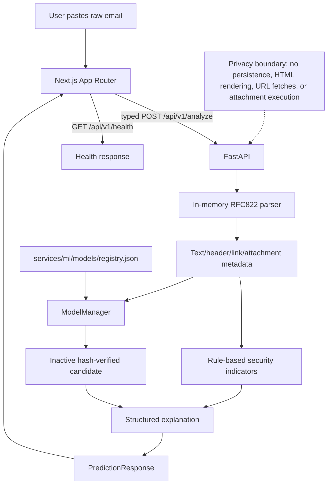

# PhishShield AI architecture

The browser owns only the current input and result state. The production `/analyze` flow does not use the legacy scan-history/report workspace. The model manager lazy-loads the registry candidate, verifies pipeline/vectorizer/manifest hashes, and never changes the registry's `activated` state.
