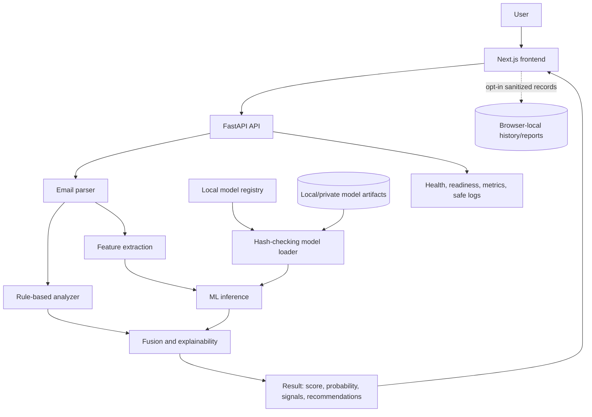
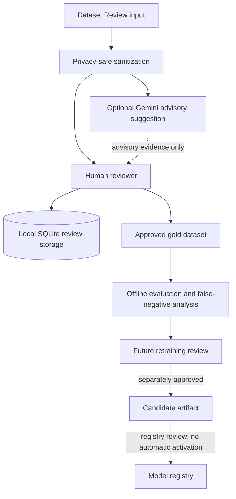
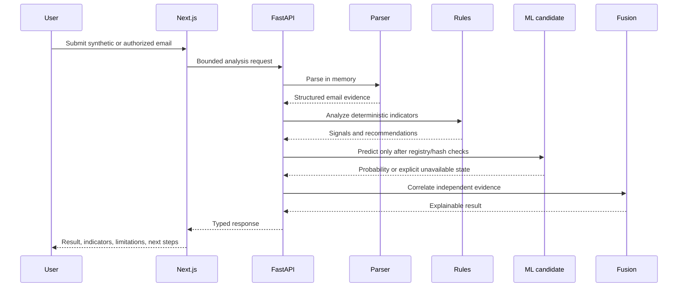

# PhishPhage AI architecture

PhishPhage AI is an academic/research prototype. The runtime analysis path and
the dataset-review path are intentionally separate. No component in this
diagram performs automatic retraining or automatic model activation.

## Runtime analysis path

```mermaid
flowchart TD
    user[User] --> web[Next.js frontend]
    web --> api[FastAPI API]
    api --> parser[Email parser]
    parser --> rules[Rule-based analyzer]
    parser --> features[Feature extraction]
    features --> ml[ML inference]
    rules --> fusion[Fusion and explainability]
    ml --> fusion
    fusion --> result[Result: score, probability, signals, recommendations]
    result --> web

    registry[Local model registry] --> loader[Hash-checking model loader]
    loader --> ml
    localArtifacts[(Local/private model artifacts)] --> loader
    api --> ops[Health, readiness, metrics, safe logs]
    web -. opt-in sanitized records .-> history[(Browser-local history/reports)]
```

The parser handles pasted text, raw RFC822 data, and `.eml` uploads as bounded
untrusted input. HTML is not rendered, URLs are not fetched, and attachments
are not executed. The model registry and hash-checking loader are local supply-
chain controls; the candidate remains inactive in the current project state.

## Dataset review and future evaluation path

```mermaid
flowchart TD
    source[Dataset Review input] --> sanitize[Privacy-safe sanitization]
    sanitize --> suggestion[Optional Gemini advisory suggestion]
    sanitize --> reviewer[Human reviewer]
    suggestion -. advisory evidence only .-> reviewer
    reviewer --> sqlite[(Local SQLite review storage)]
    reviewer --> gold[Approved gold dataset]
    gold --> evaluation[Offline evaluation and false-negative analysis]
    evaluation --> future[Future retraining review]
    future -. separately approved .-> candidate[Candidate artifact]
    candidate -. registry review; no automatic activation .-> registry[Model registry]
```

### Boundaries and responsibilities

| Component | Boundary | Responsibility |
|---|---|---|
| User/browser | User-controlled | Supplies email and interprets evidence |
| Next.js frontend | Application | Input modes, result display, history, reports, review UI |
| FastAPI API | Application boundary | Typed requests, safe errors, orchestration, health |
| Email parser | Local runtime | Bounded MIME/header/body extraction |
| Rule analyzer | Local runtime | Deterministic evidence families and recommendations |
| Feature extraction | Local runtime | Text representation and observational metadata |
| ML inference | Local/private runtime | Registry-verified candidate probability |
| Fusion/explainability | Local runtime | Corroboration, protective evidence, safe presentation |
| Model registry | Local/private | Identity, version, hashes, threshold, activation state |
| SQLite review storage | Private/local | Sanitized review records and immutable audit data |
| Gemini | Optional external advisory | Sanitized suggestion only; never authoritative |
| Gold dataset | Private/local | Human-approved metadata for offline evaluation |

## Explicit non-flows

- No URL reputation lookup or remote destination fetch occurs during analysis.
- No attachment execution or attachment-content inspection occurs.
- No raw email is sent to Gemini by the default runtime path.
- Gemini cannot change a human label, production inference result, or registry state.
- Dataset review does not retrain the model automatically.
- Evaluation does not alter the threshold, calibration, model artifact, or labels.
- A candidate model is not activated automatically.

## Request/result sequence

```mermaid
sequenceDiagram
    participant U as User
    participant W as Next.js
    participant A as FastAPI
    participant P as Parser
    participant R as Rules
    participant M as ML candidate
    participant F as Fusion

    U->>W: Submit synthetic or authorized email
    W->>A: Bounded analysis request
    A->>P: Parse in memory
    P-->>A: Structured email evidence
    A->>R: Analyze deterministic indicators
    R-->>A: Signals and recommendations
    A->>M: Predict only after registry/hash checks
    M-->>A: Probability or explicit unavailable state
    A->>F: Correlate independent evidence
    F-->>A: Explainable result
    A-->>W: Typed response
    W-->>U: Result, indicators, limitations, next steps
```

For the complete API contract, see [API.md](API.md). For model governance, see
[MODEL.md](MODEL.md). For the human review state machine, see
[GOLD_DATASET_MANAGEMENT.md](GOLD_DATASET_MANAGEMENT.md).
