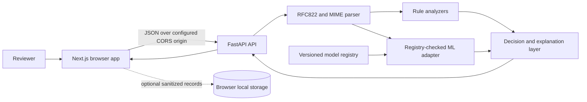
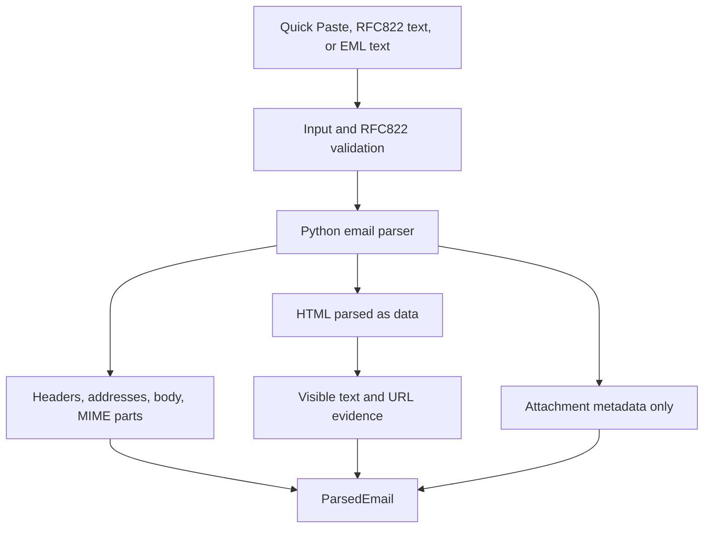
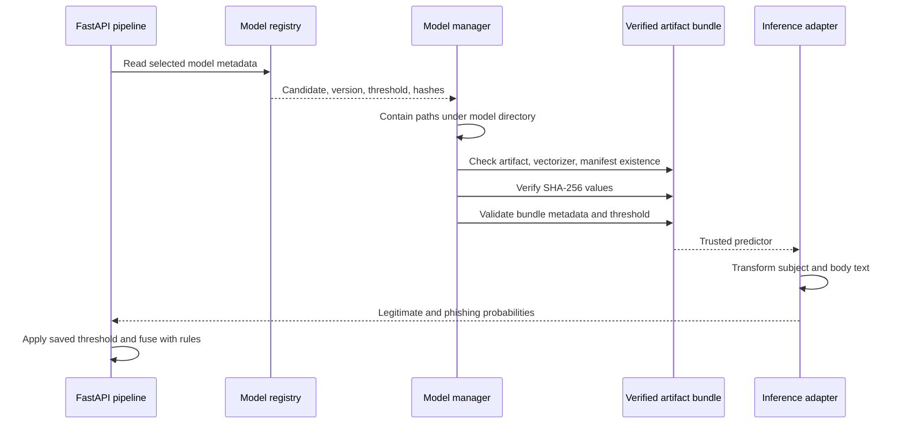
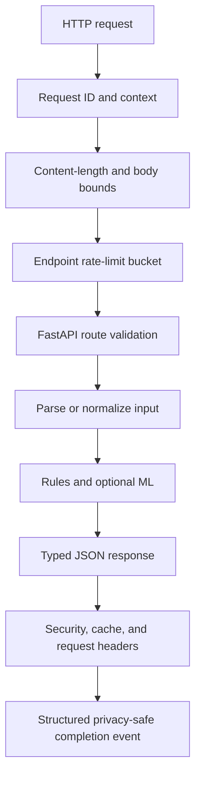
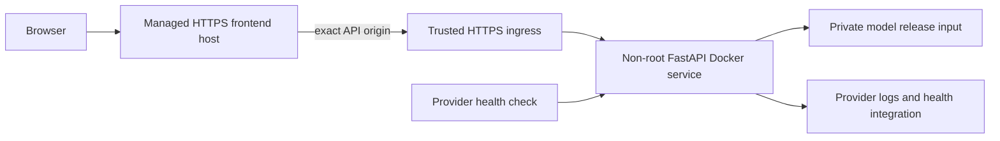

# Architecture

## System overview

PhishShield AI is a browser-to-API analysis system with a local privacy boundary. The frontend collects one input at a time. The API parses and analyzes the input in memory, then returns structured evidence. The browser may optionally save a sanitized summary of a completed scan for the dashboard, history, and report views.

```mermaid
flowchart LR
  person[Reviewer] --> browser[Next.js browser app]
  browser -->|JSON over configured CORS origin| api[FastAPI API]
  api --> parser[RFC822 and MIME parser]
  parser --> rules[Rule analyzers]
  parser --> model[Registry-checked ML adapter]
  rules --> fusion[Decision and explanation layer]
  model --> fusion
  fusion --> api
  api --> browser
  browser -. optional sanitized records .-> storage[(Browser local storage)]
  registry[Versioned model registry] --> model
```

The public product name is PhishShield AI. Some internal keys, API defaults, and historical reports still contain `PhishPhage`; this is an internal naming inconsistency, not a separate product.

## Frontend architecture

The Next.js App Router exposes the landing page and the application views `/analyze`, `/dashboard`, `/history`, `/reports`, and `/settings`. The Analyze view supports Quick Paste, raw source, and `.eml` upload. It calls the mode-aware analysis preview API for the current workflow and polls the versioned health route for backend/model status.

The API client applies timeouts and maps safe server errors to user-facing categories. React renders extracted evidence as text. It does not render submitted email HTML or create clickable extracted destinations. Local scan history is opt-in and stores derived metadata such as verdict, score, counts, recommendations, sanitized addresses, and model/rule versions; raw bodies and complete raw headers are not stored.

## Backend architecture

FastAPI registers the root endpoint, root health/readiness/metrics endpoints, and versioned v1 routes. Middleware runs before route handlers to assign or validate a request ID, enforce request-size limits, apply process-local fixed-window limits, add security headers, set `Cache-Control: no-store` for API paths, and emit privacy-safe request logs.

The API has two analysis contracts:

- `/api/v1/analysis/preview` is the mode-aware unified pipeline used by the current Analyze workspace. It returns parser output, rule analysis, ML availability/probabilities, fusion, completeness, authentication evidence, and freshness metadata.
- `/api/v1/analyze` is the smaller production raw-email inference contract. It returns model metadata, a single phishing probability, risk score, confidence, signal families, recommendations, and processing time.

## Email parsing flow

```mermaid
flowchart TD
  input[Quick Paste, RFC822 text, or EML text] --> bounds[Input and RFC822 validation]
  bounds --> mime[Python email parser]
  mime --> fields[Headers, addresses, body, MIME parts]
  mime --> html[HTML parsed as data]
  html --> visible[Visible text and URL evidence]
  mime --> attachments[Attachment metadata only]
  fields --> normalized[ParsedEmail]
  visible --> normalized
  attachments --> normalized
```

The parser rejects empty input, NUL characters, oversized messages, malformed headers, excessive headers, excessive MIME parts, excessive attachments, and excessive extracted URLs. It records filenames, content types, sizes, and risky extensions but never saves attachment bytes. HTML, CSS, metadata, forms, anchors, and tracking pixels are inspected locally; destinations are never fetched.

## Rule-based analysis

The rule engine consumes the normalized email and generates deterministic signals across content, headers/authentication, links, domains, URLs, attachments, and input completeness. Authentication is represented as pass, fail, inconclusive, or missing. Missing authentication evidence is not automatically treated as a failure. Domain comparisons use the bundled offline Public Suffix List dependency and do not perform DNS or network lookups.

The rules produce a classification, bounded risk score, confidence, recommendations, engineered feature diagnostics, and evidence text. The feature diagnostics are useful for explanation and research; the current registry-selected text model does not consume the newly added observational feature layer.

## ML inference flow

```mermaid
sequenceDiagram
  participant API as FastAPI pipeline
  participant R as Model registry
  participant M as Model manager
  participant A as Verified artifact bundle
  participant I as Inference adapter
  API->>R: Read selected model metadata
  R-->>M: Candidate, version, threshold, hashes
  M->>M: Contain paths under model directory
  M->>A: Check artifact, vectorizer, manifest existence
  M->>A: Verify SHA-256 values
  M->>A: Validate bundle metadata and threshold
  A-->>I: Trusted predictor
  I->>I: Transform subject and body text
  I-->>API: Legitimate and phishing probabilities
  API->>API: Apply saved threshold and fuse with rules
```

Model loading is lazy and cached per process. Discovery is not activation: the model manager never edits registry metadata. A missing registry, missing bundle, path escape, hash mismatch, incompatible API version, invalid probability shape, or invalid bundle metadata fails closed. When ML is optional, the unified pipeline returns deterministic rule analysis with `ml_analysis.status=unavailable`, null ML probabilities, a stale reason, and a qualified confidence for limited evidence. When `ML_REQUIRED=true`, readiness and analysis return HTTP 503 instead.

## Request lifecycle

```mermaid
flowchart TD
  request[HTTP request] --> id[Request ID and context]
  id --> size[Content-length and body bounds]
  size --> limit[Endpoint rate-limit bucket]
  limit --> route[FastAPI route validation]
  route --> parse[Parse or normalize input]
  parse --> analyze[Rules and optional ML]
  analyze --> response[Typed JSON response]
  response --> headers[Security, cache, and request headers]
  headers --> log[Structured privacy-safe completion event]
```

Every response receives `X-Request-ID`, `X-Content-Type-Options`, `Referrer-Policy`, `Permissions-Policy`, `X-Frame-Options`, and a restrictive CSP. API responses are not cached. In production, HSTS is added on the assumption that TLS is guaranteed by the trusted ingress. Unhandled exceptions become generic safe errors; development logging may include tracebacks, production logging does not.

## Observability flow

The API emits one structured completion event per request to stdout. It includes request ID, method, path, status, rounded latency, success, a truncated user agent, and a SHA-256-derived client identifier. It does not include raw IP addresses or email content. In-memory counters cover request totals, analysis calls, inference calls, failures, rate-limit hits, latency, startup, and uptime. The `/metrics` response is JSON and process-local; counters reset on restart and are not a durable monitoring system.

See [docs/OBSERVABILITY.md](OBSERVABILITY.md) for the operational contract.

## Security middleware

The security middleware is intentionally small and dependency-light. It uses direct peer identity unless an exact peer is listed in `TRUSTED_PROXY_IPS`; only then can the first `X-Forwarded-For` value influence rate limiting. CORS accepts an exact configured origin list, credentials are disabled, and allowed methods/headers are narrow. The API has no authentication or authorization layer in the current repository.

## Browser-local storage

Browser storage is outside the backend persistence boundary. The user preference `saveSuccessfulScans` controls whether sanitized scan records are written to the current browser profile. The history and reports views read those records; clearing them removes them from that profile. Storage can be unavailable or disabled, in which case analysis still works without local history. The frontend also stores UI preferences and sidebar state; this is not a server database.

## Optional Firebase integration

Firebase Admin SDK initialization is optional. The API reports `firebase=not_configured` when the complete service credential set is absent and continues to run. The repository does not define Firebase authorization rules, identity enforcement, a data schema, or a persistence workflow for raw email. Supplying Firebase credentials therefore does not turn the API into an authenticated or authorized service.

## Deployment architecture

The intended portfolio topology is a managed Next.js host and a non-root Dockerized FastAPI service. The backend provisions a private model bundle at startup, verifies its hash, and exposes a health check. The current provider files disable automatic deployment; no deployment has occurred.

```mermaid
flowchart LR
  user[Browser] --> edge[Managed HTTPS frontend host]
  edge -->|exact API origin| ingress[Trusted HTTPS ingress]
  ingress --> container[Non-root FastAPI Docker service]
  container --> release[Private model release input]
  container --> stdout[Provider logs and health integration]
  health[Provider health check] --> container
```

Horizontal scaling is not yet a production claim. Each instance loads its own model memory and maintains its own rate limiter. A shared gateway or store is required if a deployment needs coordinated limits. Provider CPU, memory, disk, pricing, sleep behavior, container startup, and HTTPS smoke testing remain unverified.

## Trust boundaries

1. Browser to frontend: input and browser storage are user-controlled.
2. Frontend to API: JSON crosses an exact CORS boundary and remains unauthenticated.
3. API to parser/analyzers: attacker-controlled email fields are treated as untrusted data.
4. API to model artifacts: the release bundle is trusted only after path, hash, schema, and metadata checks.
5. API to optional Firebase: credentials and any future shared state are deployment-controlled.
6. Deployment platform to environment/artifacts: operators control secrets, private artifact provisioning, TLS, proxy identity, and capacity.

## Failure modes and fallback behavior

| Failure | Observable behavior |
| --- | --- |
| Invalid or copied display text in raw mode | HTTP 400 with a safe validation message; Quick Paste is suggested. |
| Body, MIME, header, attachment, or URL limit exceeded | HTTP 413 or a safe validation error; parsing stops. |
| Rate limit exceeded | HTTP 429 with `Retry-After`; no analysis runs. |
| Model missing or hash invalid with optional ML | HTTP 200 unified result with rule-only analysis, null ML fields, and stale/unavailable metadata. |
| Model missing or hash invalid with required ML | Health/readiness and analysis return HTTP 503. |
| Unexpected parser/inference exception | Safe HTTP 500 response and a correlated server-side event without input content. |
| Browser storage unavailable | Current analysis remains available; history/report persistence is skipped. |
| Firebase absent | Health reports not configured; core API continues. |
| Browser automation cannot launch | Interactive security evidence remains inconclusive; no security pass is claimed. |

The architecture is designed for defensive analysis and human review, not automated enforcement or guaranteed verdicts.
